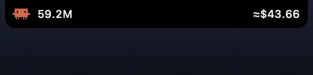

# Claude Stats — Dynamic Island for Claude Code

<p align="center">
  
</p>

A macOS menu bar app that turns your MacBook's notch into a **Dynamic Island for [Claude Code](https://claude.com/claude-code)**: live token and cost figures hugging the camera housing, per-project scoping, and an animated pixel-art Claude character that strolls around the notch — and parks upside-down beneath it when a session needs you.

Everything is parsed locally from the JSONL transcripts Claude Code already writes to `~/.claude/projects`. No network calls, no telemetry, nothing leaves your machine.

## Features

### The island

- A slim black pill wraps the notch: today's **token total** on the left wing, today's **cost** on the right, sized from the screen's real safe-area geometry (never a hardcoded notch width).
- **Hover to open** (with a short dwell so a passing pointer doesn't trigger it); move the mouse away and it collapses after a grace period. Clicking outside closes it instantly.
- The expanded panel shows a summary, per-project and per-model breakdowns, a **plan-limits tab**, a **current-task line** (the first bit of the prompt the scoped project's newest session is working on), and a project picker whose pin also drives the pill's figures.
- **Limits tab**: your plan's live usage limits — 5-hour session, weekly all-models, and weekly per-model — as percent bars with "resets 2h"-style countdowns, exactly what the Claude Desktop menu bar app shows. Fetched from Anthropic's OAuth usage endpoint every 60 s using your existing Claude Code login (read-only: the token is never refreshed or modified). Bars turn amber at 75 % and red at 90 %.
- **Chime mute**: the speaker button in the panel header silences the notification chime (persisted across launches); the visual nudges keep working.
- The picker groups **concurrent sessions under their project** — each project is a section (orange dot when a session is actively working right now, checkmark on the pinned scope) with its recent sessions beneath it: state icon (working / waiting on you / finished), task snippet, and how recently each was active.
- All expand/collapse motion runs in a single SwiftUI spring inside one fixed transparent window — no AppKit frame animation fighting it.

### The character

A hand-traced pixel-art Claude mascot, drawn from rectangles in a SwiftUI `Canvas` (no image assets, crisp at any size):

- **Idle**: breathes, blinks, and every 16 seconds strolls the **full length of the bar** — out of its home beside the token count, flipping feet-up at the notch's corner, then along the underside the whole rest of the way (beneath the housing and beneath the cost section — the left wing is its only indoor spot) to the bar's far end, a beat hanging there, and the same trip back. It never passes "through" the notch: the interior is the camera cutout, so the path deliberately hugs the outside where there are actual pixels. Motion renders at display refresh rate with smoothstep-eased journeys.
- **Nudging**: when a session needs your attention it walks out, somersaults, and parks **upside-down at the middle of the notch** — feet planted on the housing's bottom edge — bouncing, glowing, and pulsing ripple rings, while a synthesized **8-bit coin chime plays three times** (square-wave, rendered in memory — no audio asset). Hovering in while it's parked opens the island already scoped to the waiting project; tapping it does the same.
- Honors **Reduce Motion**: every animation collapses to a meaningful static frame.

### Attention detection

The island knows a session is waiting on you by reading only the **tail** of each transcript (never a full re-parse):

- A dangling `AskUserQuestion` or `ExitPlanMode` tool call → a question is waiting (30-minute window).
- A **finished turn** — the tail ends in plain assistant text with no tool call, after ≥10 s of file quiet → Claude stopped and is waiting for your reply (3-minute window, so the beacon stays punchy rather than camping).
- Deliberately conservative, verified against a real multi-thousand-file corpus: a dangling ordinary tool (`Bash`, `Edit`, …) is indistinguishable on disk from a permission prompt, so it is treated as "running", never guessed at. Subagent sidechain transcripts and known background-session noise (e.g. `claude-mem` observers) are excluded.

### The rest

- **Opens at login**: installed as a `.app`, it registers itself on first run so the island is simply there after a reboot — toggle any time via right-click on the menu bar item → *Launch at Login*.
- **Status-item fallback**: the same figures and popover live in a regular menu bar item, so external/notchless displays are fully covered.
- **Live updates** via FSEvents with debounce + max-wait; parsing is incremental per file (device/inode identity, offset resume, truncation/rewrite detection).
- **Cost math** from a pricing table keyed by model id, with an "estimated" marker whenever an unknown model's pricing had to be inferred.
- **Dev CLI** for quick terminal checks.

## Requirements

- macOS 14+
- Swift 6 toolchain (Xcode 16+)
- A notched MacBook for the island itself — on other displays the status item carries everything
- Claude Code writing transcripts to `~/.claude/projects` (the default)

## Install

### From source (recommended)

Builds locally — no Gatekeeper friction — installs to `/Applications`, launches, and registers itself to open at login:

```sh
git clone https://github.com/Ziadabdelsalam/claude-stats-dynamic-island.git
cd claude-stats-dynamic-island
bash scripts/install.sh
```

Toggle the login item any time: right-click the menu bar figure → **Launch at Login**.

### Prebuilt app

Grab `ClaudeStats.app.zip` from [Releases](https://github.com/Ziadabdelsalam/claude-stats-dynamic-island/releases) (Apple Silicon), unzip, move to `/Applications`, then clear the quarantine flag once (the app is ad-hoc signed, not notarized):

```sh
xattr -cr /Applications/ClaudeStats.app
open /Applications/ClaudeStats.app
```

## Build & run

```sh
swift build
swift test          # 94 tests

# Menu bar app, debug:
swift run ClaudeStatsApp

# Proper .app bundle (release, ad-hoc signed):
bash scripts/bundle.sh
open .build/ClaudeStats.app
```

### CLI

```sh
swift run ClaudeStatsCLI --summary            # today / all-time totals
swift run ClaudeStatsCLI --projects           # per-project breakdown
swift run ClaudeStatsCLI --models             # per-model breakdown
swift run ClaudeStatsCLI --json               # machine-readable output
swift run ClaudeStatsCLI --root /path/to/dir  # alternate transcript root
```

## Architecture

```
Sources/
├── ClaudeStatsCore/          # pure logic, no UI — fully unit-tested
│   ├── TranscriptParser      # JSONL → UsageEvent, incremental per-file offsets
│   ├── TranscriptWatcher     # FSEvents, debounced + max-wait coalescing
│   ├── Aggregator            # events → RollupSnapshot (today/all-time/session/project/model)
│   ├── Pricing               # model pricing table + estimated fallback
│   ├── AttentionDetector     # tail-only scan: waiting tools, finished turns, current task
│   └── UsageStore            # @MainActor @Observable façade: refresh loop, scoping, expiry timers
└── ClaudeStatsApp/
    ├── StatusItemController  # NSStatusItem + popover (all displays)
    ├── IslandController      # borderless non-activating NSPanel around the notch
    └── Views/
        ├── IslandView        # collapsed pill, expanded panel, character choreography
        ├── ClaudeCharacter   # the pixel mascot: Canvas + TimelineView clock math
        └── PopoverRootView…  # shared panel content (summary / projects / models)
```

Design notes:

- The island window has **one constant frame** covering the full expanded footprint, centered on the notch; it never moves or resizes. Every expand/collapse is SwiftUI-internal, which is what keeps the pill pixel-stable against the notch. Transparent regions pass clicks through.
- The character's motion is **pure clock math** off `TimelineView` — no timers, no stored animation state beyond the single "nudge started at" instant.
- The core library never touches the UI and the UI never parses a file; `UsageStore` is the only seam.

## Privacy

The app reads files under `~/.claude/projects` (or `--root`), aggregates them in memory, and displays the result. Its only network request is the Limits tab's fetch of `https://api.anthropic.com/api/oauth/usage`, authenticated with your locally stored Claude Code token (read from the `Claude Code-credentials` Keychain item, `~/.claude/.credentials.json` as fallback — macOS may ask once to allow Keychain access). Nothing else ever leaves your machine.

## Tuning

The personality knobs are single constants:

| What | Where |
| --- | --- |
| Wing width (pill tightness) | `IslandView.wingWidth` |
| Hover-open dwell / close grace | `IslandView` (`120 ms` / `350 ms`) |
| Roam cadence | `IslandView.roamOffset` (`16 s` period) |
| Finished-turn quiet gate & lifetime | `AttentionDetector` (`turnQuietSeconds`, `turnStaleAfterMinutes` — 10 s / 3 min) |
| Chime melody, repeats, volume | `AttentionChime` |
| Plan-limits poll interval | `PlanLimitsStore.start` (`60 s`) |
| Limit bar warning thresholds | `LimitsView.fill` (`75 %` / `90 %`) |
| Question-nudge lifetime | `AttentionDetector.staleAfterMinutes` |

## License

[MIT](LICENSE)
